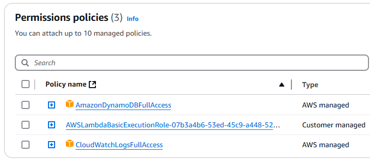
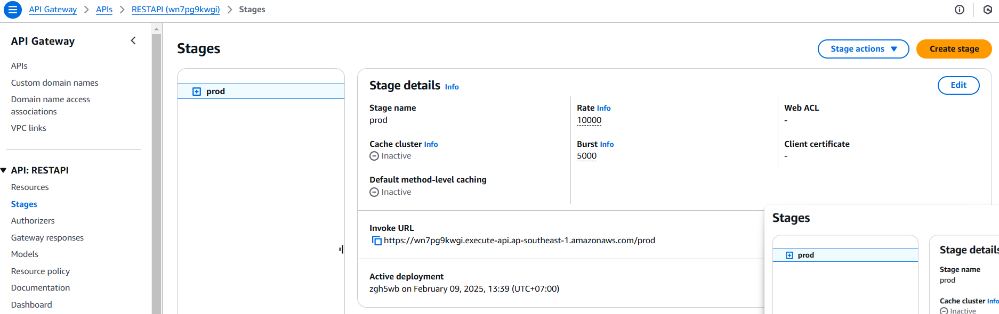
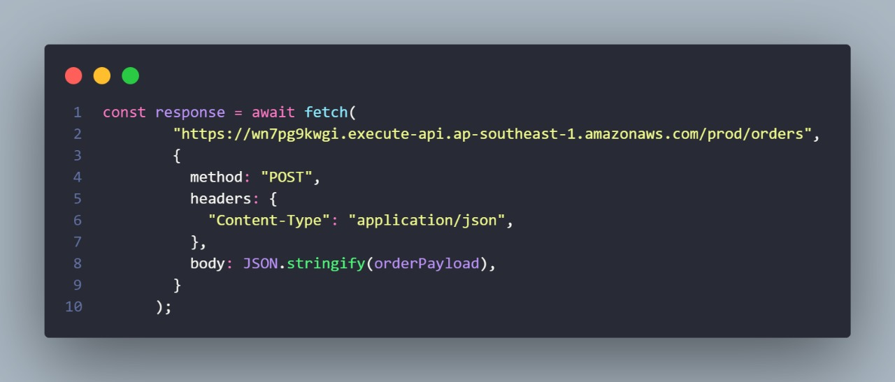
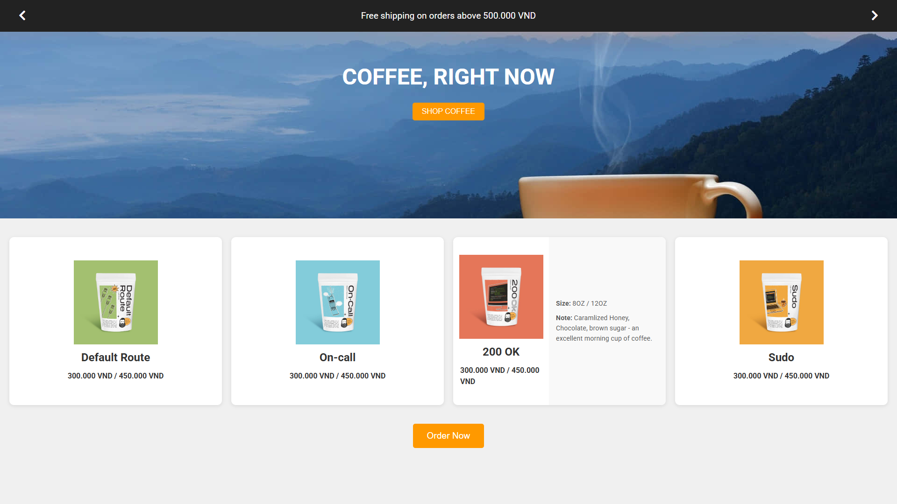
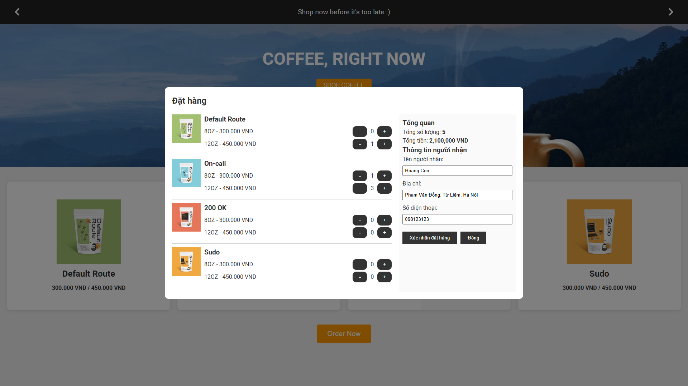
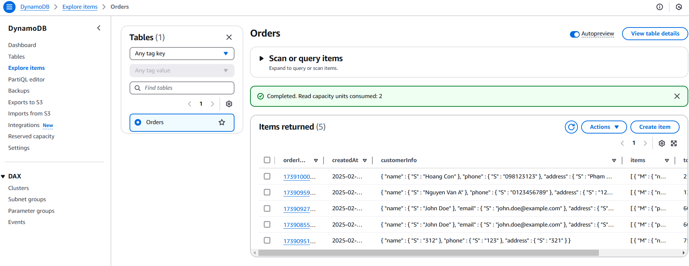

# Introduction 🚀

This is a basic project designed to help you get started with **Serverless** architecture.

---

# Technologies Used 🛠️

- **React + Vite**
- **AWS API Gateway**
- **AWS Lambda**
- **AWS DynamoDB**

---

# Installation Guide 📦

## 1. DynamoDB

- **Step:** Create a new table with the primary key **"orderID"**.

---

## 2. AWS Lambda

- **Step:** Create a new **Lambda function**.
- **Configuration:** Set up the necessary permissions to allow logging and read/write access to **DynamoDB**.

> ⚠️ **Note:** In a real-world scenario, it is recommended to grant only the necessary permissions rather than full access.

<div align="center">
  
</div>

- **Step:** Upload the provided **function.zip** file (included in the source) to the Lambda function. Once the upload is complete, your Lambda function is ready to use.

---

## 3. AWS API Gateway

- **Step:** Create a new **API Gateway**.
- **Configuration:** Add a resource named **/orders** and configure a **POST** method.

<div align="center">
  
</div>

- **Step:** Open the **Home.jsx** file located in the **src/Component** folder.
- **Configuration:** Replace the endpoint with your own **Invoke URL** found in the API Gateway's **Stages** section.

<div align="center">
  
</div>

<div align="center">
  
</div>

---

## 4. Start the Web Project

- **Step 1:** Navigate to the project directory in your terminal.
- **Step 2:** Install dependencies by running:

  ```sh
  npm install
  ```

- **Step 3:** Start the development server with:

  ```sh
  npm run dev
  ```

**Result:** If everything is set up correctly, you should see the web interface and can start using its features.

<div align="center">
  
</div>
<div align="center">
  
</div>

---

## 5. Verify Data Storage in DynamoDB

After testing the functionality, confirm that the data has been successfully stored in **DynamoDB**:

<div align="center">
  
</div>
